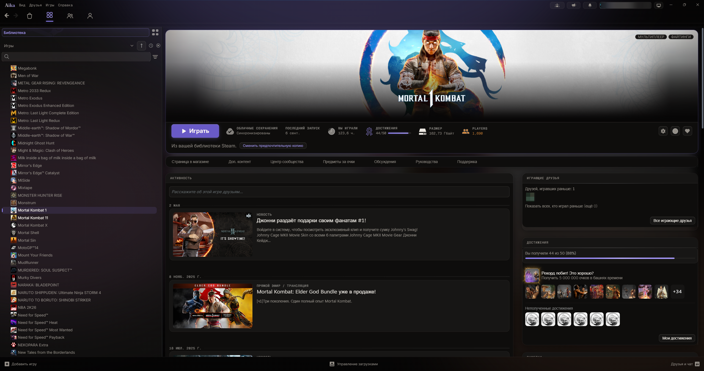
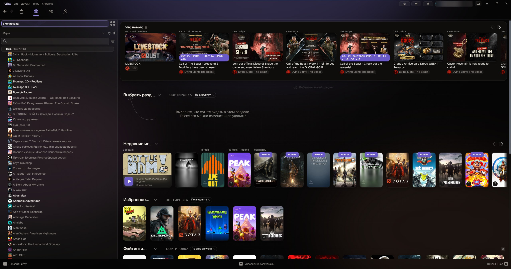
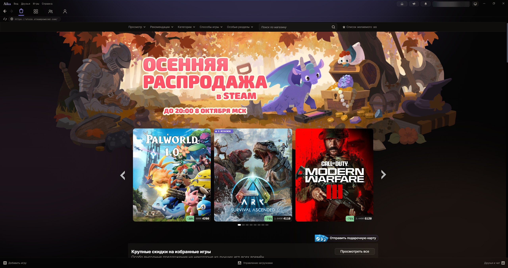
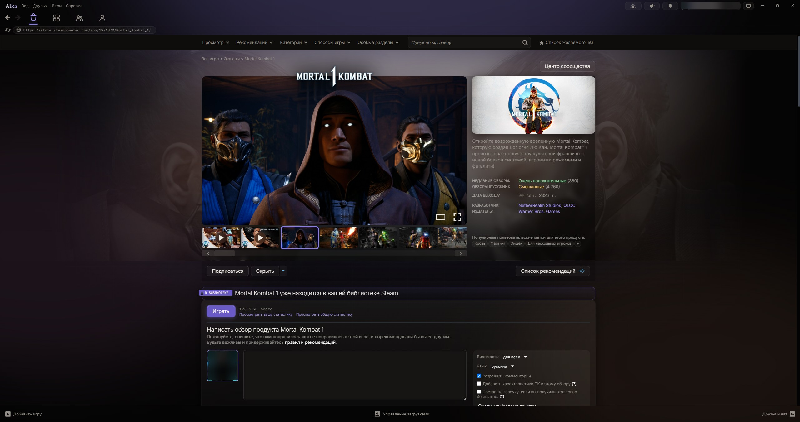
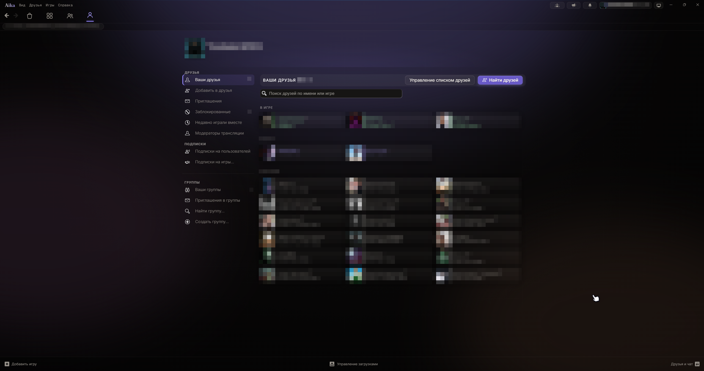
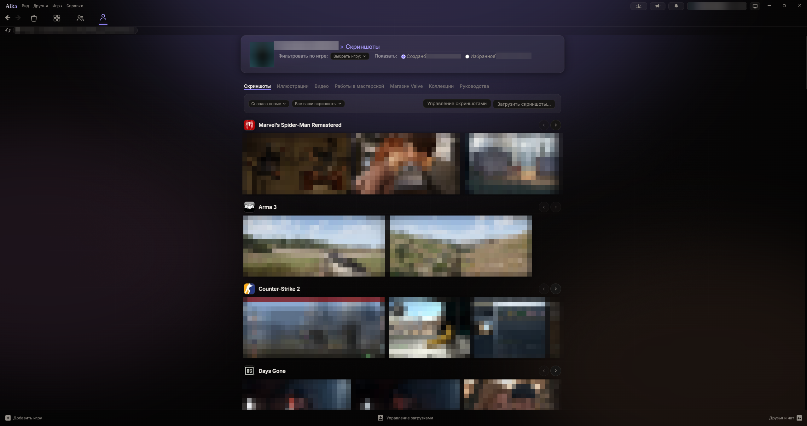
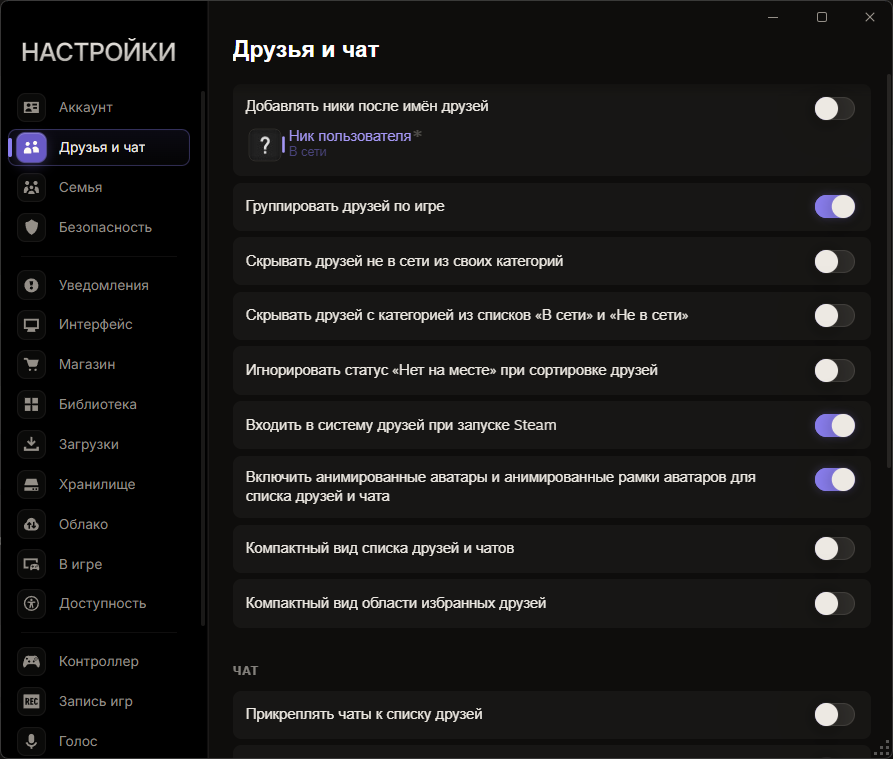

# Aika

**A warm dark theme for Steam** · [Millennium](https://steambrew.app) · 0.1.0b (WIP) · by **hatewxb**

A calm dark interface on a near-black background with soft spots of warm
light. Fluent structure, rounded corners, one signature accent instead of
Steam's light blue. The theme doesn't change any Steam text, only the look.

- **Game logo above the trailer** in the store and an Apple-style **trailer player**.
- **Cinematic store game page**: trailers play muted behind the logo,
  price and buttons over the whole window, with a media gallery and viewer
  (the classic layout is one setting away).
- **Screenshots grouped by game** in the profile: a carousel shelf per game.
- **Cursor glow** on large library blocks.
- **Top bar tabs centered** (can be moved back to the left).

## Screenshots

| Library | Store |
|:--:|:--:|
|  |  |
| **Store game page** | **Friends** |
|  |  |
| **Screenshots by game** | **Settings** |
|  |  |

## Installation

1. Install [Millennium](https://steambrew.app).
2. Download `Aika-<version>.zip` from [Releases](../../releases).
3. Extract the `Aika` folder into `C:\Program Files (x86)\Steam\millennium\themes\`.
4. Steam → **Millennium → Themes** → **Aika**. If theme scripts are disabled, enable them.

Theme settings (the gear next to Aika in Millennium): **Main** — top bar tab
position, store game page layout (Cinematic / Classic), cursor glow and its
radius, color preset, notification wordmark and opacity; **Advanced** — custom
colors, set on the **Colors** page.

## Roadmap

| Section | Done | Not done yet |
|:--|:--|:--|
| Library | Home, game list, game page, game news, achievements, filters, collections | Long game titles on hover |
| Store | Home, menu, game page (Early Access, warnings), search, wishlist, cart, News Hub | Checkout, free weekends and trials |
| Community | Activity, friends, screenshots, artwork, videos, profile editing, notifications, game discussions | Workshop, collections, profile, the rest of the game community hub |
| Friends & chat | Friends list, direct chat, mini profiles | Group and voice chat, friend requests |
| Downloads | Everything | — |
| Settings & windows | Settings, game properties, dialogs, Family View PIN | Login window |
| General | Menus, tooltips, notifications dropdown, notification toasts (message, "now playing", download) — liquid glass, smooth entrance | Other notifications, presets, Big Picture, overlay |

## Licenses

The Inter, Geist Mono, Fraunces, UnifrakturMaguntia and Shojumaru fonts are
licensed under the SIL Open Font License 1.1 (`assets/fonts/OFL-*.txt`). The
notification liquid glass is [hyalite](https://github.com/VII-Cae/hyalite--liquid-glass),
MIT (`js/vendor/LICENSE-hyalite.txt`).
